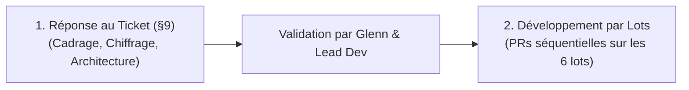

# Cadrage & Décryptage : Mission AssoExpert IA

> **Document de synthèse et de cadrage opérationnel**  
> **Destinataire :** Fulbert Missekpe  
> **Projet :** AssoExpert IA — Akiligue SAS / Cabinet Maé  
> **Date :** Lundi 21 septembre 2026  

---

## 1. Contexte du mail et des intervenants

| Rôle | Personne / Entité | Fonction |
| :--- | :--- | :--- |
| **Développeur (Toi)** | Fulbert Missekpe | Développeur en charge de la proposition MVP et du développement |
| **Expéditeur du mail** | Pether (Fullstack dev) | Co-équipier / relais technique |
| **Chef de projet** | Glenn (DevPeth) | Interlocuteur technique unique sur le ticket cadre |
| **Lead Développeur** | Lead Dev Nootec | Supervision technique (en copie du mail) |
| **Cliente & Porteuse de projet** | Laetitia Badji / Gonzalez | Cabinet Maé / AKILIGUE SAS (cliente finale et experte métier) |

---

## 2. Ce qu'on te demande concrètement

### 🛑 Règle d'or : Ne commence PAS à coder tout de suite !
Le document cadre l'indique explicitement (§0 et §9) :
> **« Première action attendue : Répondre selon le §9 avant d'écrire du code »**

Ton équipe et ton chef de projet n'attendent pas de code immédiat. Ils attendent un **document d'alignement technique et de chiffrage (réponse au ticket)** sous 5 jours ouvrés.

### 📋 En résumé, ton travail se déroule en deux temps :

---

## 3. Comprendre les deux fichiers transmis

### Fichier 1 : `ticket-mvp-assoexpert.md` (Le Ticket Cadre Développeur)
C'est le **cahier des charges technique et opérationnel** rédigé par Glenn. Il définit :
- **Le produit AssoExpert IA** : Un SaaS d'assistance experte pour les associations françaises employeuses (1 à 100 salariés) couvrant 4 domaines : RH/Conventions collectives, Gouvernance 1901, Finance/Subventions, Conformité (DUERP, RGPD).
- **Le cœur de valeur** :
  1. Un **assistant IA** adapté au profil de l'association et aux briques souscrites.
  2. Une **escalade vers une experte humaine** (questions posées à Laetitia, traitées sous 48h selon le quota de la formule).
  3. Un **site vitrine public optimisé pour le SEO** (acquisition organique de clients).
- **La stack technique retenue (100% sans dépendance propriétaire)** :
  - **Next.js 16** (App Router, TypeScript strict)
  - **Tailwind CSS + shadcn/ui**
  - **PostgreSQL** auto-hébergé + **Drizzle ORM**
  - **Better Auth** (sessions en base, multi-tenant par organisation)
  - **Payload 3** (CMS intégré pour les pages SEO, les tarifs, les prompts et le traitement des questions expertes)
  - **Stripe Billing** + Customer Portal (aucun écran de facturation custom à coder)
  - **Anthropic Claude SDK** (streaming avec Haiku 4.5 et Sonnet 5)
  - **VPS Coolify + Docker** pour l'hébergement
- **Les 6 lots de livraison** : Découpage précis avec Critères d'Acceptation (CA).

### Fichier 2 : `HANDOFF.md` (Le Design System PilotAsso)
Pether t'indique : *« Pour l'instant use les design system de PilotAsso, c'est dans le HandOff (prends juste le design) »*.
- **Ce que ça signifie** :
  - Tu ne dois pas concevoir de nouvelle charte graphique, ni attendre des maquettes complètes de zéro.
  - Tu dois **appliquer fidèlement les codes graphiques de PilotAsso** à AssoExpert :
    - **Couleurs :** Bleu interactif (`#004AAD`), Navy pour le texte (`#0A2540`), Lime pour les éléments IA / succès (`#C1FF72`), fond d'application (`#F5F7FA`).
    - **Typographies :** Sora pour les titres (display), Hanken Grotesk pour le corps de texte (minimum 16px).
    - **Composants & Formes :** Boutons et inputs arrondis à 12px, cartes et modales à 16px, ombres légères teintées de navy.
    - **Icônes :** Librairie **Lucide** exclusivement (trait 2px).
    - **Ton éditorial :** Français (fr-FR), vouvoiement, majuscule uniquement en début de phrase (*sentence case*), aucun emoji.

---

## 4. Clarification importante sur le « Mobile »

Dans son mail, Pether ajoute : *« j'attends ton retour pour les Autres écrans mobiles »*.
Il est essentiel de lever toute confusion :
- **Sur PilotAsso** : Tu as travaillé sur une véritable application mobile Flutter native (`pilot-asso-mobile`).
- **Sur AssoExpert IA** : Le cahier des charges (§5) indique formellement qu'une application mobile native est **HORS MVP**.
- **Ce qui est attendu pour AssoExpert** : Une **application Web responsive impeccable sur mobile** (Next.js), avec un score de performance mobile **Lighthouse $\ge$ 90** sur smartphone.

---

## 5. Les 5 livrables obligatoires à fournir (selon le §9)

Pour valider le ticket avec Glenn et ton Lead Dev, tu dois leur soumettre un document Markdown contenant ces 5 parties :

### 1. Reformulation du besoin (max 10 lignes) & Questions / Zones d'ombre
- Synthèse du projet et du périmètre MVP.
- Questions à poser à Glenn / Laetitia (ex. : divergence des grilles tarifaires dans le CDC, quota exact de questions expertes en formule Pro, modèle d'IA pour l'offre d'entrée).

### 2. Chiffrage par lot (en Jours/Homme) & Calendrier de livraison
Estimation réaliste du temps de réalisation pour chacun des 6 lots :
- **Lot 1 :** Socle technique & DevOps (VPS, CI/CD, Coolify, monitoring GlitchTip/Umami)
- **Lot 2 :** Auth, Multi-tenant organisations, Profils d'association
- **Lot 3 :** Abonnements Stripe & Droits d'accès (Customer Portal, Webhooks, Entitlements)
- **Lot 4 :** Assistant Chat IA (Streaming, briques thématiques, historique sécurisé)
- **Lot 5 :** Escalade Question Experte (Tickets 48h, gestion de quotas, emails, back-office Payload)
- **Lot 6 :** Site public vitrine & SEO (Pages piliers, landing, gabarit CMS, JSON-LD)

### 3. Choix techniques argumentés
- Validation de la stack (Next.js 16 + Payload 3 + Drizzle ORM + Better Auth).
- Justification de la réutilisation des tokens et composants du Design System PilotAsso.

### 4. Schéma Relationnel de la Base de Données (ERD Mermaid)
- Modélisation visuelle des tables clés : `organizations`, `organization_profiles`, `memberships`, `subscriptions`, `conversations`, `messages`, `expert_tickets`, `ai_usage`.

### 5. Top 5 des Risques & Stratégies de Mitigation
- Comment gérer le risque de dépassement de coût IA.
- Comment garantir l'isolation stricte multi-tenant entre associations.
- Comment gérer le cas des réponses réglementaires obsolètes de l'IA.
- Idempotence et fiabilité des webhooks Stripe.
- Respect des performances SEO (Core Web Vitals sur mobile).

---

## 6. Prochaines étapes recommandées

1. **Valider la lecture de ce document de cadrage**.
2. **Générer le document officiel de réponse au ticket (§9)** complet, chiffré et prêt à être envoyé à Glenn, Pether et ton lead dev.
3. **Préparer l'email d'accompagnement** prêt à l'envoi pour ton boss et tes collègues.
